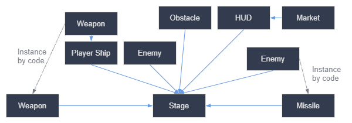
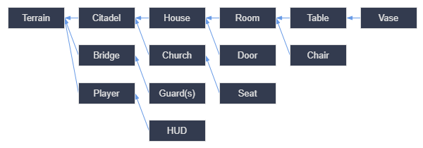

# インスタンスの作成

> 参考：https://docs.godotengine.org/ja/4.x/getting_started/step_by_step/instancing.html

前のパートでは、シーンは1つのノードをルートとし、ツリー構造で構成されたノードの集まりであることを見てきました。
プロジェクトは、いくつものシーンに分割することができます。
この機能により、ゲームの様々なコンポーネントを分解して整理することができます。

好きなだけシーンを作成し「テキストシーン」を意味する`.tscn`拡張子のファイルとして保存できます。
前のレッスンで作成した`label.tscn`がそれです。
これをシーンのコンテンツに関する情報をパックすることから「Packed Scenes」と呼ばれています。

一度保存したシーンは設計図として機能し、他のシーンで何度でも再利用することができます。
これをインスタンス化(instancing)と言います。

インスタンス化されたシーンは、ノードのように動作し、エディタはデフォルトでコンテンツを隠蔽します。
インスタンス化を行うと、複製したノードのみ表示されます。
また複製された各ノードにはユニークな名前を持っています。

## 実際に使う

実際にインスタンス化を使って、Godotで具体的にどう動くのか見てみましょう。
まずは[instancing_starter.zip](https://github.com/godotengine/godot-docs-project-starters/releases/download/latest-4.x/instancing_starter.zip)をダウンロードします。

ダウンロードしたら解凍し、Godotでプロジェクトをインポートします。

このプロジェクトには2つのパックされたシーンが含まれています。
`main.tscn`（ボールと衝突する壁を含む）、`ball.tscn`のシーンです。

ではMainノードの子としてボールを追加してみましょう。

追加したらプロジェクトを実行してみてください。
ボールが落ちるのが見えたら成功です。

さらにボールノードを作成するには、ボールを選択して`Cmd-D`を入力して複製を行います。

もう一度実行してボールが複数個落下したら成功です。

## シーンとインスタンスの編集

インスタンスの機能には、他の複製したインスタンスとは別に値を変更できたりします。

またボールには`PhysicsMaterial`という値があり、普通では値を変更できません。
理由はリソースだからであり、値を変更するのであればコンテキストメニューから「Make Unique」を選択します。

## デザイン言語としてのシーンインスタンス

Godotのインスタンスとシーンは優れたデザイン言語を提供し、他のエンジンとは一線を喫しています。

Godotでゲームを作る場合、MVC（Model-View-Controller）やEntity-Relationshipダイアグラムのようなアーキテクチャのコードパターンを排除することをお勧めします。

その代わり、プレイヤーがゲームの中で目にする要素を想像することから始め、それらに基づいてコードを構成すると良いでしょう。

ダイアグラムができたら、そこに記載されている各要素のシーンを作成して、ゲームを開発することをお勧めします。
シーンのツリーを構築するために、コードまたはエディタで直接インスタンス化を使用するのが良いでしょう。

プログラマは、抽象的なアーキテクチャを設計し、そこにコンポーネントを当てはめようとすることに多くの時間を費やす傾向にあります。
シーンをベースとした設計は、開発をより早く、より簡単にし、ゲームロジックそのものに集中することができます。
ほとんどのゲームコンポーネントはシーンに直接マッピングされるため、シーンのインスタンス化をベースにしたデザインを使用すると、他のアーキテクチャのコードはほぼ必要ありません、

以下の画像は大量のアセットとネストされた要素を持つオープンワールドゲームのシーン図を表しています。

まず部屋を作るところから始めると想像してください。
株をユニークに配置したいくつかの異なる部屋のシーンを作成します。
その後インテリアに複数の部屋のインスタンスを使用する家のシーンを作成します。
インスタンス化した多くの家と、城塞をおくための大きな地形から城塞を作成します。
これらはそれぞれ1つまたは複数のサブシーンをインスタンス化したシーンとなります。

あとは衛兵のシーンを作成し、城塞に追加します。
これは間接的にゲームの世界全体に追加したことになります。

Godotでは、このようなシーンを作成してインスタンス化するだけで、簡単にゲーム上で反復することができます。
またエディタは、プログラマ、デザイナー、アーティストが同様に利用できるように設計されています。
典型的なチーム開発では、2D,3Dのアーティスト、レベルデザイナー、ゲームデザイナー、アニメーターが参加し、全員がGodotエディターで作業を行います。

## 要約

インスタンス化とは、設計図からオブジェクトを生成プロセスで、以下のような便利な使い方があります。

- ゲームを再利用可能なコンポーネントに分割する機能。
- 複雑なシステムを構造化し、カプセル化するためのツール。
- ゲームプロジェクトの構造を自然な方法を考えるための言語。
