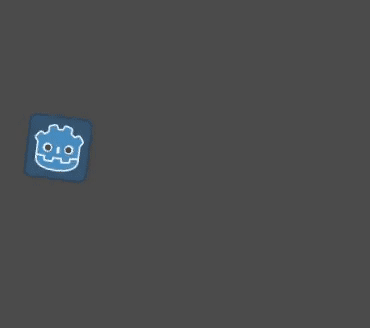

# 初めてのスクリプト作成

> 参考：https://docs.godotengine.org/ja/4.x/getting_started/step_by_step/scripting_first_script.html

このレッスンでは、Godotのアイコンを円を描くように回転させる、初めてのスクリプトを作成します。
冒頭でも触れたように、ここではプログラミングの基礎知識があることを前提としています。



## プロジェクトの設定

ではまず新規プロジェクトの作成を行います。
プロジェクトには1つの画像ファイルが含まれている必要があります。
今回は我々のコミュニティでのプロトタイピングによく使用されるGodotアイコンを使います。


アイコンをプロジェクトに追加するには以下の手順を行います。

1. シーンドックで「Other Node」を選択
2. そこから「Sprite2D」を選択
3. テクスチャにダウンロードしたアイコンのパスを指定する

## 新規スクリプトの作成

作成したSprite2Dにスクリプトを追加するには「Attach Script」を選択します。

「Template」フィールドの「Node: Default」から「Object: Empty」に変更して、空のファイルを作成します。

`sprite_2d.gd`ファイルを開いて以下のコードを記述します。

```godotengine
extends Sprite2D
```

全てのGDScriptファイルは暗黙的なクラスです。
`extends`キーワードは、このスクリプトが継承または拡張クラスであることを定義します。
この場合、`Sprite2D`は、Sprite2Dノードの全てのプロパティと関数にアクセスできます。

継承されたプロパティは、インスペクタードックで確認できるものが含まれます。

## やっはろー

今のところスクリプトは何もしません。
手始めに「やっはろー！」というテキストを出力パネルに表示させましょう。

スクリプトに次のコードを記述します。

```godotengine
func _init():
    print("やっはろー！")
```

`func`キーワードは`_init`という名前の新しい関数を定義します。
これはクラスのコンストラクターの特別な名前です。
この関数を定義すると、エンジンがメモリ内にオブジェクトまたはノードを作成すると`_init()`が初期化のために呼ばれます。

> GDScriptはインデントベースの言語です。
> コードが機能するには、`print()`という行の先頭にあるタブが必要です。
> これを省略したり、行を正しくインデントしなかったりすると、エディタはそれを赤で強調します。
> またエラーメッセージで`Unexpected indentation`（予期しないインデント）と表示されます。

## 回転させるには

それでは、ノードを移動・回転させてみましょう。
そのためには、スクリプトに2つのメンバ変数を追加します。
1つは1秒あたりの移動速度（ピクセル単位）、もう1つは1秒あたりの角速度（ラジアン単位）です。
`extends Sprite2D`の行の後に、以下のコードを追加してください。

```godotengine
var speed = 400
var angular_speed = PI
```

メンバ変数はスクリプトの先頭付近`extends`行の後、関数の前に置かれます。
このスクリプトがアタッチされている全てのノードインスタンスは、`speed`（速度）`angular_speed`（角速度）プロパティの独自のコピーを持ちます。

アイコンを移動するには、ゲームループ内のフレームごとにアイコンの位置と回転を更新する必要があります。
`Node`クラスの`_process()`仮想関数を使用して、`Sprite2D`などの拡張クラス内で定義します。
そうするとGodotはフレームごとに関数を呼び出し、最後のフレームからの経過時間を示す`delta`という名前の引数を渡します。

> ゲームは1秒あたりに数多くの画像をレンダリングすることで機能します。
> 各画像はフレームと呼ばれ、ループしてレンダリングされます。
> ゲームが画像を生成する速度をフレーム／秒（FPS）で測定します。
> ほとんどのゲームは`60FPS`を目指していますが、低速のモバイルデバイスでは`30FPS`、バーチャルリアリティゲームでは`90~240FPS`のような数値になります。
>
> エンジンとゲームの開発者は、一定の時間でゲームの世界を更新し、レンダリングするために最善を尽くします。
> しかしフレームのレンダリング時間には常に小さな変動があります。
> これはエンジンがフレームレートに依存しないモーションを作成するため提供するデルタタイムです。

スクリプトの最後の関数を定義します。

```godotengine
func _process(delta):
	rotation += angular_speed * delta
```

> Godotでは`_init(), _process()`のようにアンダースコアで始まる関数を仮想関数といいます。
> これはエンジンとやりとりするためオーバーライドされた組み込み関数です。

シーンを実行して、Godotアイコンが回転すれば成功です。

## 前進させるには

ノードを動かすには、`_process()`関数に以下のコードを追加します。

```godotengine
var velocity = Vector2.UP.rotated(rotation) * speed

position += velocity * delta
```

`var`キーワードは新しい変数を定義します。

`velocity`変数は方向と速度の両方を表す2Dベクトルです。
ノードを前進するには`Vector2.UP`を用いて、回転は`rotated()`メソッドを呼び出します。

シーンを実行してGodotアイコンがぐるぐる回転すれば成功です。

次のパートでは、プレイヤーの入力を使ってノードをコントロールする方法について学びます。

## 完全なスクリプト


```godotengine:sprite_2d.gd
extends Sprite2D

var speed = 400
var angular_speed = PI


func _process(delta):
	rotation += angular_speed * delta

	var velocity = Vector2.UP.rotated(rotation) * speed

	position += velocity * delta
```

