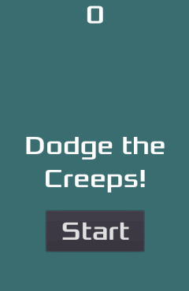

# 最初の2Dゲーム

> 参考：https://docs.godotengine.org/ja/4.x/getting_started/first_2d_game/index.html

この章では、初めての2Dゲームを作成します。
作成するゲームは以下のようなものです。

このチュートリアルではエディタの使い方、プロジェクトの構成方法、2Dゲームの作り方を学びます。

このゲームの名前は「クリープをよけろ！」です。
あなたのキャラクターはできるだけ長く動いて敵を避けなければなりません。

ゲームを作っていく中で次のようなことを学びます。

- Godotエディタを利用した2Dゲームの作り方。
- シンプルなゲームプロジェクトの組み立て。
- プレイヤーの移動、画像の変更。
- ランダムに敵を生成。
- スコアのカウント。

### ゲーム開発は2Dから始めた方が良い？

ゲーム開発初心者やGodotに慣れていない方は2Dゲームから始めることをお勧めします。
これにより複雑になりがちな3Dゲームに取り組む前に、両方に慣れることができます。

このプロジェクトの完成バージョンは、以下の場所にあります。

- https://github.com/godotengine/godot-demo-projects/tree/master/2d/dodge_the_creeps
- https://github.com/godotengine/godot-demo-projects/tree/master/mono/dodge_the_creeps

## 前提条件

前の章の「ステップバイステップ」を完了した初心者が対象。

もし経験のあるプログラマであれば、上記のソースコードを見ても良いです。

以下のアセットをダウンロードしていること。

https://github.com/godotengine/godot-docs-project-starters/releases/download/latest-4.x/dodge_the_creeps_2d_assets.zip
