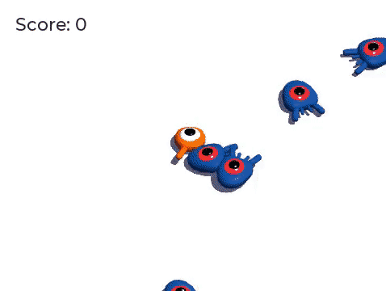

# 最初の3Dゲーム

> 参考：https://docs.godotengine.org/ja/4.x/getting_started/first_3d_game/index.html

ここではGodotを使って最初の完全な3Dゲームを作成します。
このシリーズが終わる頃には、下のアニメーションGIFのような、シンプルで完成されたプロジェクトになるでしょう。

ここでコーディングするゲームは「最初の2Dゲーム」に似ていますが、ひねりが加えられています。
ジャンプをしてクリープを踏み潰すことが目標になります。
この方法では、前のチュートリアルで学んだパターンを認識し、新しいコードと機能でパターンを元に構築することになります。

これから以下のことを学びます。

- ジャンプ機構で3D座標を操作。
- キネマティックボディを使って3Dキャラクターを動かし、衝突判定も追加。
- 物理レイヤーとグループを使用して、特定のエンティティのインタラクションを検出。
- 一定の時間間隔でモンスターをインスタンス化し、基本的な手続き型ゲームプレイをコーディング。
- アニメーションをデザインし、実行時にその速度を変更。
- 3DゲームにUIを描画。

などなど。

このチュートリアルは入門シリーズを全て完了した初心者向けです。
また経験豊富なプログラマーの方は、以下のリンクからソースコード全体を参照できます。

https://github.com/godotengine/godot-demo-projects/tree/master/3d/squash_the_creeps

ゲームアセットは以下のURLから入手できます。
ダウンロードしておきましょう。

https://github.com/godotengine/godot-docs-project-starters/releases/download/latest-4.x/3d_squash_the_creeps_starter.zip

まずプレイヤーの移動に関する基本的なプロトタイプを作成します。
次に画面の周りにランダムに出現するモンスターを追加します。
その後ジャンプとつぶしのメカニズムを実装し、アニメーションでゲームを洗練させます。
最後にスコアとリトライのスクリーンを作ります。
