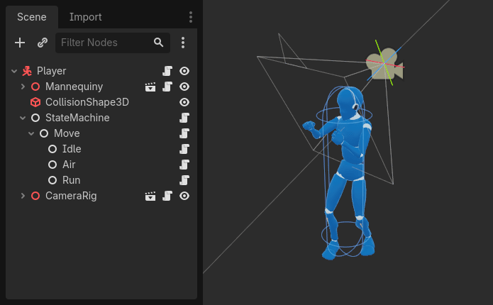

# はじめに

これからのレッスンでは最初の[2Dゲーム](https://docs.godotengine.org/ja/4.x/getting_started/first_2d_game/index.html#doc-your-first-2d-game)を作成することになります。

このゲームを作るにつれてゲーム開発に必要な基礎やこのゲームエンジンについて学ぶことになるでしょう。

## ノードとシーン

Godotのシーンとは、ツリーで構成され各シーンはノードのツリーとして構成されます。

### ノード

ノードとは、ゲームの基礎的な構成要素です。
ノードはレシピの材料のようなものです。
ノードには、画像を表示したり、音を鳴らしたり、カメラを表現したりと、様々な種類があります。

全てのノードには以下の特徴があります

- 名前
- 編集できるプロパティ
- 毎フレーム、更新するコールバックを受け取る
- 新しいプロパティや関数で拡張が可能
- 別のノードを子として追加できる

特に上記の最後の項目が重要で、ノードが組み合わさることでツリーを形成するが、これはプロジェクトを管理する上で非常に強力です。
異なる機能を持つノードが組み合わさることで、より細かな挙動を生み出すことが可能となります

### シーン

上記のキャラクターのようにツリー内のノードを編成したものをシーンと言います。
また保存すると、シーンは新しいタイプのノードのように動作し、既存のノードの子として追加できます。
シーンのインスタンスは内部が非表示になっている単一のノードとして表示されます。

シーンを使用することで、ゲームのコードを好きなように構成できます。
ノードを構成して、走ったりジャンプしたりするゲームキャラクター、ライフバー、操作できるチェストなど、独自で複雑なノードタイプを作成できます。

Godotエディタは基本的にシーンエディタです。
2D3Dのシーンを編集するためのツールや、ユーザーインターフェースなどが充実しています。
1つのGodotプロジェクトには、必要なだけのシーンを含めることが可能です。
エンジンが最低限必要とするのは、メインシーンのみです。これはGodotがはじめにロードするシーンです。

シーンにはノードに機能を追加すること以外にも、以下のような特性があります。

1. Playerのように、常に1つのルートノードが存在する
2. ローカルドライブに保存され、あとで読み込みが可能
3. シーンのインスタンスは複製が可能

### 最初のシーンを作成する

それでは最初のシーンをノード1つだけで作成してみましょう。
新しいプロジェクトを作成し、プロジェクトを開くと空のエディタが表示されます。

空のシーンでは、ルートノードを素早く追加するための選択肢がいくつか表示されます。

ノードは左側のシーンドックに表示され、ノードのプロパティは右側のインスペクタードックに表示されます。

### ノードのプロパティの変更

次はLabelのプロパティを変更して、Hello Worldと表示してみましょう。

変更するにはTextプロパティの下の入力フィールドをクリックしてHello Worldと入力します。

### シーンの実行

シーンを実行するには、画面右の「現在のシーンを実行」ボタンを押すか`Cmd + R`を押します。

シーンを実行するには保存が必要で、`label.tscn`という名前で保存してください。

シーンを終了するには、`Cmd + .`を押すか、ウィンドウを閉じます。

### メインシーンの設定

プロジェクトのメインシーンを実行するには「プロジェクトを実行」ボタンを押すか、`Cmd + B`を入力します。

次のパートでは、ゲームとGodotのもう1つの重要な概念、シーンのインスタンスの作成について説明します。

