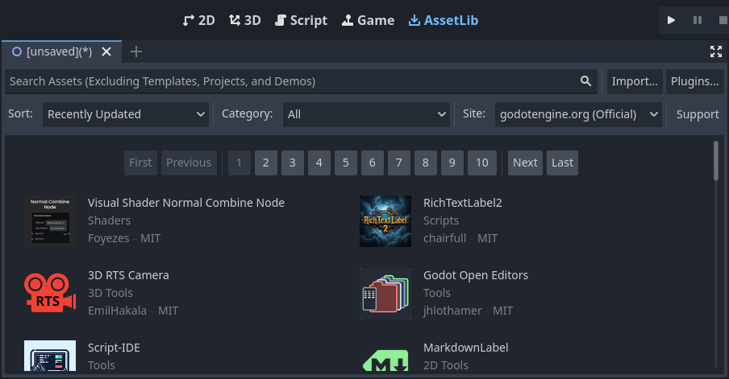

# 初めてのGodotエディタ

> 参考：https://docs.godotengine.org/ja/4.x/getting_started/introduction/first_look_at_the_editor.html

ここではGodotのインターフェースについて簡単に説明します。
エディタでよく使われるメイン画面とドックを見ていきます。

## プロジェクトマネージャー

Godotを起動すると、最初に表示されるのはプロジェクトマネージャーです。
デフォルトのプロジェクトでは、既存のプロジェクトの管理や、新しいプロジェクトのインポート、新規作成などができます。

## 初めてのエディタ

ウィンドウの上部にはアセットライブラリという別タブがあります。
そこで「オンラインにする」ボタンをクリックするとプロジェクトマネージャーがインターネットにアクセスします。
エディタはデフォルトではインターネットにアクセスしません。

ネットワークモードを「オンライン」に設定すると、コミュニティによって開発された多くのプロジェクトが含まれる
オープンソースアセットライブラリででもプロジェクトを検索できます。

ここからエディタの言語、インターフェーステーマ、表示スケール、ネットワークモード、ディレクトリの命名規則を変更できます。

新しいプロジェクトや既存のプロジェクトを開くと、エディタのインターフェースが表示されます。

メインシーンのトップから、左側にメインメニュー、中央にワークスペース切り替えボタン、右側にプレイテスト、ムービーメーカーモードの切り替えボタンがあります。

そのすぐ下に、現在開いているシーンが表示されます。タブのプラスボタンをクリックすると、新しいシーンが追加されます。
最も右側のボタンを押すと、気を散らさないモードに切り替えることができ、インターフェース内のドックを隠すことでビューポートのサイズを最大化します。

中央のシーンセレクターの下にはビューポートがあり、その上部にはツールバーがあります。ここでシーンの移動、拡大縮小、ロックなどができます。

ビューポートの両側にはドックパネルがあります。
ファイルシステムドックには、スクリプト、画像、オーディオといったプロジェクトファイルが一覧表示されます。

シーンドックにはアクティブなシーンノードが一覧表示されます。

インスペクターでは、選択されたノードのプロパティを編集することができます。

ビューポートの下にある下部パネルは、デバッグコンソール、アニメーションエディター、オーディオミキサーなどがあります。
またデフォルトでは折りたたまれており、クリックすると開きます。

## 5つのメイン画面

エディタ上部に5個並んでいるのが、メイン画面のボタンです。（2D, 3D, Script, Game, AssetLib）

2D画面は、あらゆる種類のゲームにおいて使用されます。

3D画面は、3Dゲームにおけるメッシュモデル、光源の操作、レベルデザインなどの作業が行えます。

ゲーム画面は、エディタからプロジェクトを実行した時にプロジェクトが表示される場所です。
プロジェクトを通じてテストし、リアルタイムで一時停止して調整することができます。
ここでの調整がどのように機能するかをテストするためのものであり、
ゲームが停止すると変更は保存されないので注意が必要です。

スクリプト画面は、オートコンプリート、組み込みリファレンス、デバッガーを使用できます。

アセットライブラリは、プロジェクトで使えるフリーでオープンソースのアドオン、スクリプト、
アセットのライブラリです。

## 統合されたクラスリファレンス

Godotには組み込みクラスのリファレンスが付属しています。

クラス、メソッド、プロパティ、定数、シグナルに関する情報は以下のいずれかの方法で検索できます。

- エディタ内の任意の場所で`Opt + Space`を押す。
-  スクリプtがめんのみぎうえにある「ヘルプを検索」ボタンをクリックする。
- 「ヘルプ」メニューをクリックする。
- スクリプトエディター内で、クラス名、関数名、組み込み変数の上で`Cmd + Click`する。
